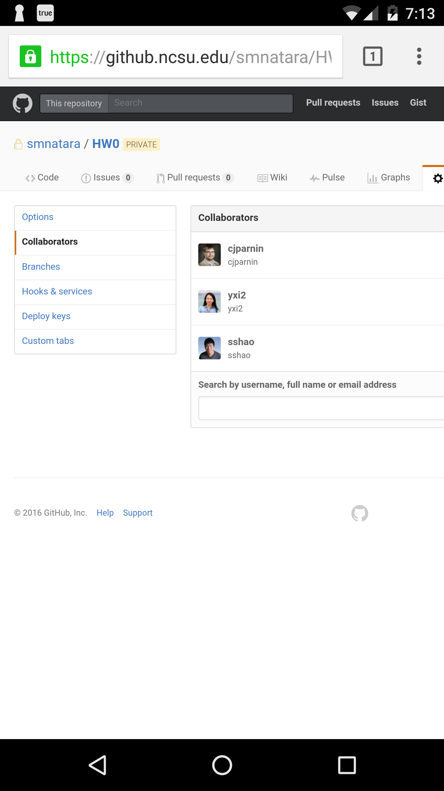

##### Github (10)

Sign into [NCSU's GitHub](https://github.ncsu.edu/).

1. Create a *private* repo called HW0. 
2. Go to Settings, Collaborators and Teams, and add the TAs and instructor as a collaborator (using their unity id).

--------
##### Github profile + collaborators

