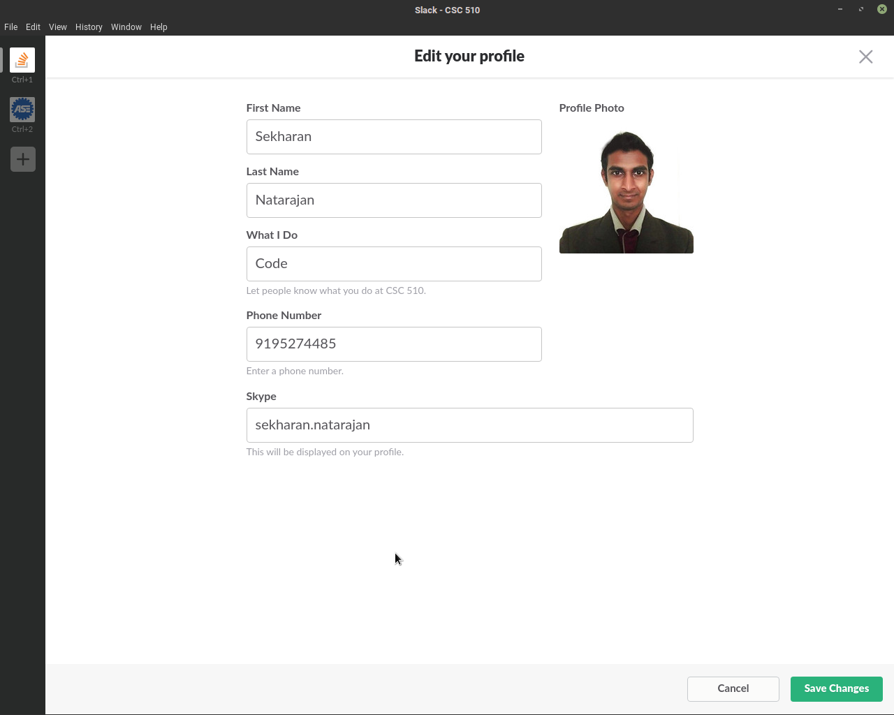
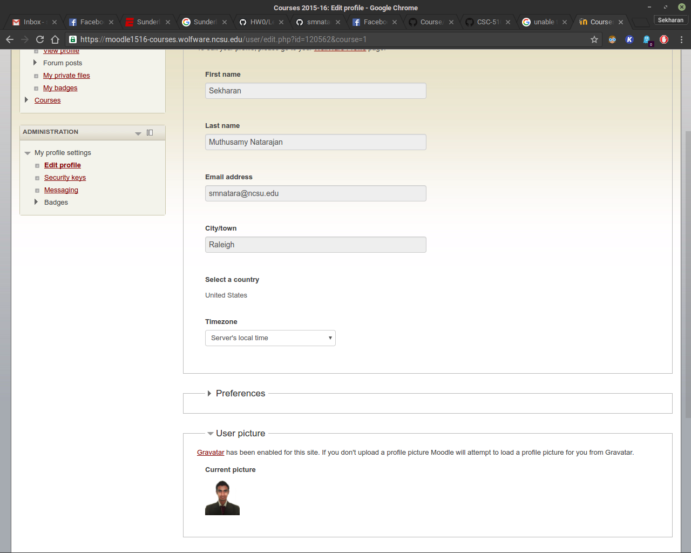

##### Slack+Moodle (10)

Properly setting up your Slack and Moodle profile by providing a picture will help the teaching staff learn your name. Upload a current headshot picture of you (not anyone else, not a cartoon picture of you, etc.) to your Moodle profile. For Slack, make sure you have your first and last name as part of your profile. Use [US passport photo guidelines](http://travel.state.gov/passport/pptphotoreq/photocomptemplate/photocomptemplate_5297.html).

##### Slack profile

##### Moodle profile
