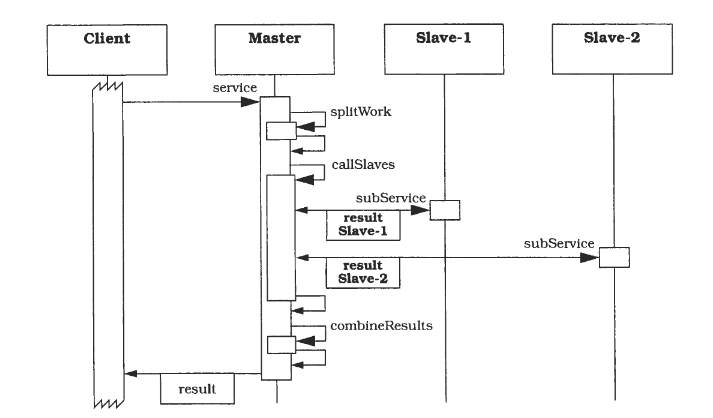

## Design patterns have been critized for being too specific and artifically limited by OO language constraints. Find and describe any pattern that may be useful in building software. Define and describe 3 patterns that you have found.

**1. Master Slave Pattern:**

Master slave pattern is a pattern for organizing work within a system.
The Master-Slave pattern supports fault tolerance,  parallel computation and computational  accuracy. A master component distributes work to identical slave components and computes a final result from the results these slaves return.

Master-Slave applies the 'divide and conquer' principle. Work is partitioned  into several subtasks that are processed  independently. The result of the whole  service is calculated using the results that each partial processing operation provides. The Master-Slave pattern is widely applied in the areas of parallel and distributed computing. 

**Example :** The traveling-salesman problem is well-known in graph theory. The task is to find an optimal round trip between a given set of  locations, such as the shortest trip that visits each location exactly once. The solution to this problem is of high computational complexity and is NP complete.

_ To solve the master slave problem, the following considerations need to be taken: _ 

	1. Divide work. Specify how the computation of  the task can be split into a set of  equal sub-tasks. Identify the sub-services that are necessary to process a sub-task. 
	
	2. Combine sub-task results. Specify how the final result of the whole service can be computed with the help of the results obtained from processing individual sub-tasks. 

	3. Specify the  cooperation between master and slaves. Define an interface for the sub-service identified in step 1. It will be implemented by the slave and used by the master to delegate the processing of indi- vidual sub-tasks

------

