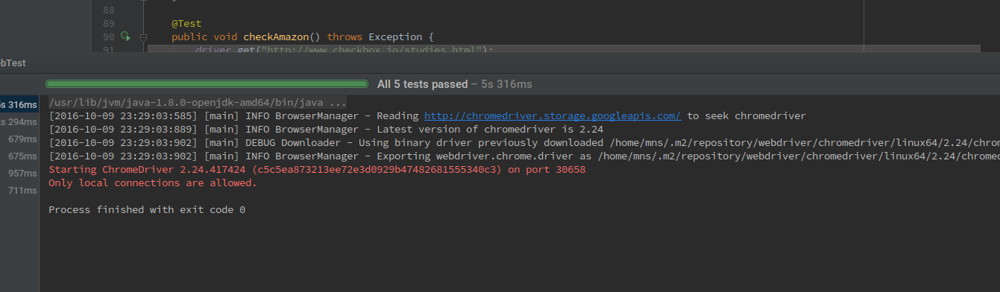

### HW3
- Submitted by Sekharan Natarajan (smnatara)

### For Knockout + bootstrap exercise, please visit this page [twitter](twitter_layout/)

### Selenium:

##### Output :

How to run?
1. Open the selenium folder in IntellijIdea
2. Find the WebTest.java inside the src folder, right click and "Run as JUnit test"

------------------------------------

Question
## SELENIUM (60 points)

You will help test out a survey hosting site, http://checkbox.io

Write unit tests using Selenium that verify the following:
http://checkbox.io/studies.html

* The participant count of "Frustration of Software Developers" is 55
* The total number of studies closed is 5.
* If a status of a study is open, you can click on a "Participate" button.
* Check if the "Software Changes Survey" has a Amazon reward image.

