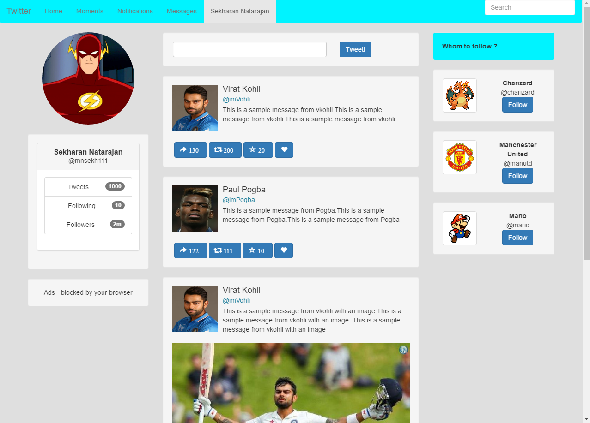
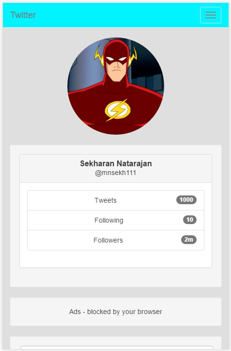
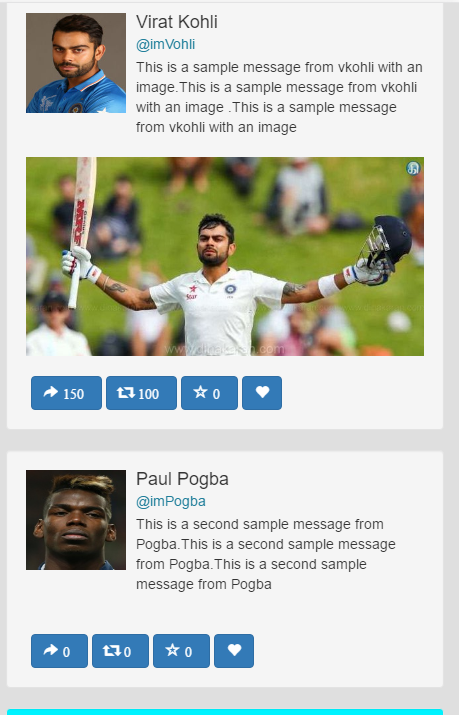

### Twitter webpage design

#### Layout on a PC



Bootstrap is responsive by default.

#### Layout on a Mobile device

pic 1             |  pic 2
:-------------------------:|:-------------------------:
  |  

    


#### Mock data file : [mock.json](mock_data/mock.json)


#### Knockout code:

```html
<div class="media-object-default" data-bind="foreach:tweets">
                       <div class="well">
                           <div class="media-left"><a href="#"></a></div>
                           <div class="media-body">
                               <h4 class="media-heading" data-bind="text:author">Media heading 2</h4>
                               <h5 class="media-heading" style="color: #1f7e9a" data-bind="text:id">Media heading 2</h5>
                               <div data-bind="text:message">
                                   This is the content inside the media-body. By default the media is top-aligned. Use
                                   class
                                   'media-middle' or 'media-bottom' to middle align or bottom align them, respectively.
                                   <br>
                               </div>
                               <br>
                           </div>
                           
                           <div class="row tweet-control">
                               <button type="button" class="btn btn-primary"><span
                                       class="glyphicon glyphicon-share-alt"><span style="padding:5px"
                                                                                   data-bind="text:replies"></span></span>
                               </button>
                               <button type="button" class="btn btn-primary"><span
                                       class="glyphicon glyphicon-retweet"><span style="padding:5px"
                                                                                 data-bind="text:retweets"></span></span>
                               </button>
                               <button type="button" class="btn btn-primary"><span
                                       class="glyphicon glyphicon-star-empty"><span style="padding:5px"
                                                                                    data-bind="text:favorites"></span></span>
                               </button>
                               <button type="button" class="btn btn-primary"><span
                                       class="glyphicon glyphicon-heart"></span></button>
                           </div>
                       </div>
                   </div>
               </div>
```


-------------------------------
Question


## Knockout, CSS (40 points)

Generate a simple webpage that can create a twitter timeline. Your goal is not to create a pixel perfect replication, but to gain practice in using web technologies to learn how to layout UI elements and generate dynamic content.

#### Example


#### Implementation

* Use Bootstrap/CSS to layout elements.
* Use mock data (images/text) for you timeline.
* Use knockout js and data binding to render mock data.

#### UI elements

Your timeline should have:

* At least 3 tweets
* A user profile picture (on left), user name (on top).
* Tweet text
* At least one tweet with a picture, and at least one tweet without a picture.
* Basic stats about tweet (retweet, favorites) on bottom.

* README.md
* A gh-branch (Github Pages) for viewing your javascript/css/html.
* Code for Selenium
