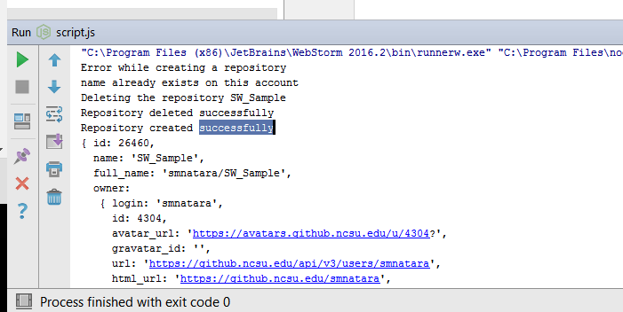
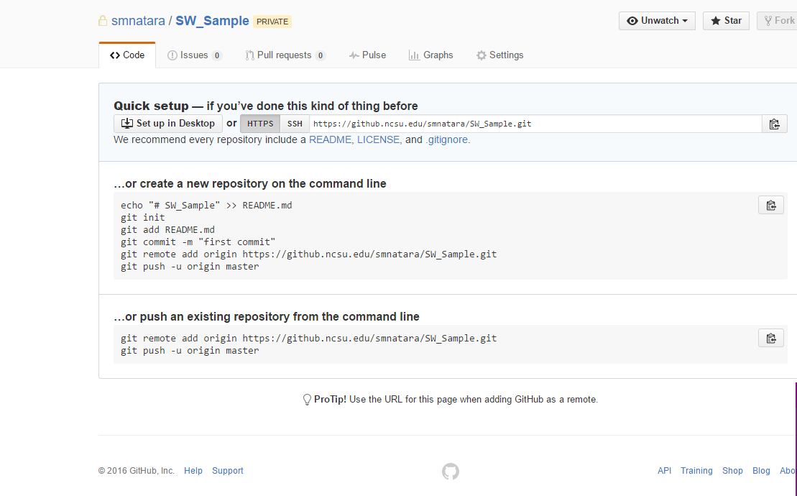
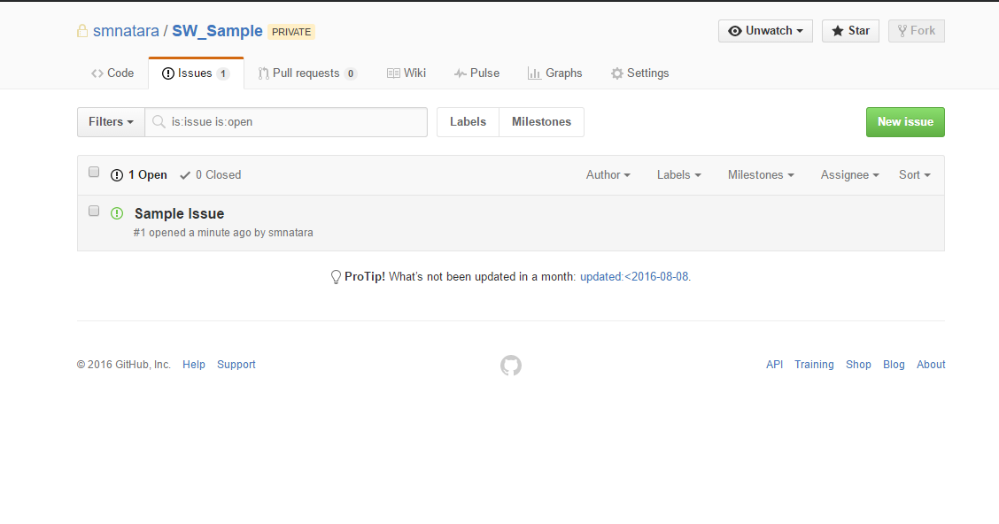
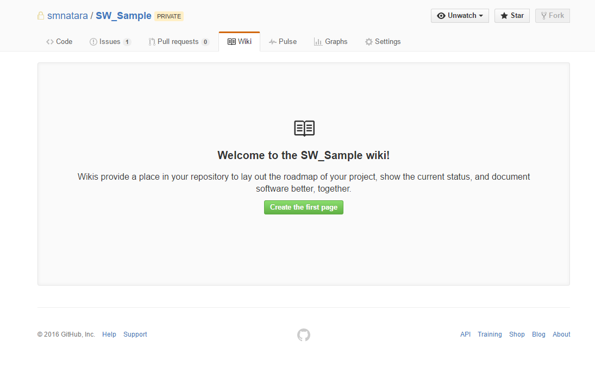

# Using GitHub REST API to perform the following operations

   * ### List branches
   This function takes in the owner id and the repository name and lists the branches in
   that repository
   ```javascript
   function listBranches(owner, repo)
   ```
   
   Output:
   
   
   
   * ### Create Repo
   This function takes in the name of the repo, a description, homepage and a boolean
   indicating if the repo is private or not. **If the repo with the same name exists, it 
   deletes the repo and recreates it**.
   ```javascript
   function createRepo(name, description, homepage, priv)
   
       ->function deleteRepo(owner, name, next)
   ```
   Output:
   
   
   
   * ### Create issue
   This function takes in the owner Id, repo name, title of the issue and body of the issue
   and creates an issue
   ```javascript
   function createIssue(owner, repo, title, body)
   ```
   
   Output:
   
   
   
   
   * ### Edit a repo to enable wiki
   This function takes in the owner id and repo name and enables wiki support
   for the repo.
   ```javascript
   function enableWiki(owner, repo)
   ```
   
   Output:
   
   
   
